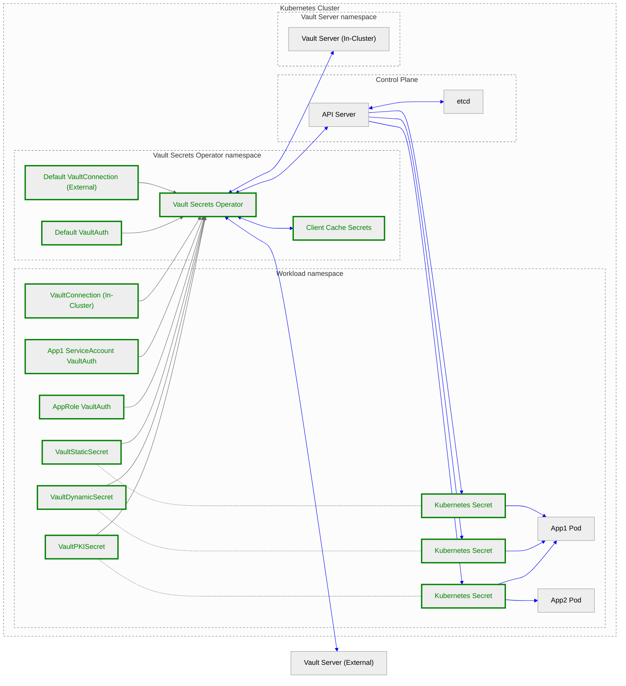

# Vault Secrets Operator Threat Model

The Vault Secrets Operator synchronizes secrets from Vault to [Kubernetes Secrets](https://kubernetes.io/docs/concepts/configuration/secret/). This threat model highlights how using the Vault Secrets Operator affects users' security posture.

## Executive summary and recommendations

The Operator occupies a privileged position in a Kubernetes cluster, with unencrypted access to all secrets being synced, and extra care must be taken to secure and monitor it via both Vault and Kubernetes permissions and auditing. In particular:

* Deploy the Operator [in its own dedicated namespace](https://developer.hashicorp.com/vault/docs/platform/k8s/vso/installation#installation-using-helm), with access limited via RBAC to a small set of operators.
* RBAC permissions must be tightly controlled within each namespace, both for explicit and implicit access to Kubernetes Secrets.
* Enable both Vault and Kubernetes audit logging and monitor for unusual access patterns.
* Configure the Operator to [encrypt the client cache secret contents](https://developer.hashicorp.com/vault/docs/platform/k8s/vso/helm#v-controller-manager-clientcache-storageencryption) (if enabled) at the application level using the Transit engine.
* Define VaultAuth objects per unit of trust (e.g. an application, or a namespace) with distinct, granular Vault roles and policies to ensure auditability and principle of least privilege.
* Encrypt the Kubernetes etcd database at rest using a KMS provider. Kubernetes Secrets stored in etcd are [not encrypted at rest by default](https://kubernetes.io/docs/concepts/security/secrets-good-practices/).
* Use TLS negotiated by a well-secured certificate authority for all networked communication, especially for Vault and the Kubernetes API.
* Update the Operator, Vault, and other systems regularly to guard against known vulnerabilities.

## Terminology

* Operator: The Vault Secrets Operator
* Vault: The HashiCorp Vault server(s) with which the Operator communicates
* Cluster: The Kubernetes cluster
* Secret CR: A VaultStaticSecret, VaultDynamicSecret, or VaultPKISecret custom resource that defines a secret to be synced from Vault to a Kubernetes Secret
* Client Cache: The Operator can optionally store Vault tokens and secrets in Kubernetes Secrets to act as a cache and maintain secret leases through Operator restarts and rollouts.

## Scope and limitations

### Scope

* Communication, consumption, and storage of Vault’s secret material within a Kubernetes cluster using the Vault Secrets Operator.

### Limitations

* Securing and configuring Vault and its policies is not considered, and is covered by [Vault’s threat model](https://developer.hashicorp.com/vault/docs/internals/security).
* Kubernetes is a highly configurable system with many ways to deploy it on-premises and in cloud-hosted environments. The threat model will not go into depth on any one specific mode of deployment, and instead will focus on Kubernetes concepts and primitives that are widely applicable. Instead, refer to the [security documentation](https://kubernetes.io/docs/concepts/security/) and the [Trail of Bits audit](https://github.com/trailofbits/audit-kubernetes/blob/master/reports/Kubernetes%20Threat%20Model.pdf).
* No secondary effects after disclosing secret material are considered.

## Detailed Description

Full documentation for the Vault Secrets Operator can be found on the [developer website](https://developer.hashicorp.com/vault/docs/platform/k8s/vso).

### Data Flow Diagram

The following is a data flow diagram for the Operator. Nodes in green represent Kubernetes resources that the Operator consumes or creates.

Links in blue represent the flow of secret data:

* The Operator sends Kubernetes service account tokens or other authentication data to Vault, and receives back Vault tokens and Vault secrets.

* The Operator can optionally store and retrieve Vault tokens and secrets in Kubernetes Secrets (the Client Cache) within its own namespace.

* The Operator may request Kubernetes service account tokens or other authentication data (stored in Kubernetes Secrets) from the API Server. It sends Vault secrets to the API Server for storage as Kubernetes Secrets to be used by workload applications.

* The API Server stores and retrieves those Vault secrets as Kubernetes Secrets in etcd.

* Finally, pods can mount Kubernetes Secrets from their own namespace as files in an ephemeral volume or as environment variables. If they have permission, they can also query the Kubernetes Secrets directly from the API Server.

## Threats

The following threats and assets were enumerated while considering several types of attacks that may affect the confidentiality or integrity of secrets synced from Vault:

1. Secret material in transit between Vault, the Operator, and the API server.
1. Secret material at rest in etcd.
1. API access to Operator namespace (privileged service account, Kubernetes Secrets used as cache).
1. Access to Operator pods (in-memory cache secrets, privileged service account).
1. API access to workload namespace (workload Secrets, execing into containers, deploying pods that reference the created secrets).
1. Access to workload secrets mounted into pods (ephemeral volumes, environment variables, in-memory values).
1. Misconfiguration of Kubernetes RBAC and Operator custom resources.

### Threats specific to the Operator

<table>
  <tr>
   <td>
<strong>ID</strong>
   </td>
   <td><strong>Threat</strong>
   </td>
   <td><strong>Categories</strong>
   </td>
   <td><strong>Description</strong>
   </td>
   <td><strong>Mitigation</strong>
   </td>
  </tr>
  <tr>
   <td>1
   </td>
   <td>An attacker can snoop on or tamper with secret data in transit between the Operator and Vault
   </td>
   <td>Information disclosure, tampering, integrity, spoofing
   </td>
   <td>The network route configured between the Operator and Vault could be within the cluster, or to an external address either over a VPC or the public internet.
   </td>
   <td>
<ul>

<li>Communication with Vault should be encrypted via TLS
</li>
</ul>
   </td>
  </tr>
  <tr>
   <td>2
   </td>
   <td>Users have access to an overly permissive Vault policy via a namespaced or default VaultAuth
   </td>
   <td>Information disclosure
   </td>
   <td>All workload namespaces can use the default VaultAuth CR, which defines the role the Operator will authenticate to Vault as, and also the policies it will receive. As such, the default VaultAuth defines Vault secrets that are available to the whole cluster.

Each namespace can also deploy its own VaultAuth objects for use only within that namespace. There are no restrictions over which Secret CR can reference which VaultAuth within one namespace, so a Kubernetes namespace is an important trust boundary when considering which namespaces should have access to which Vault roles and policies.
   </td>
   <td>
<ul>

<li>The default VaultAuth should use a role that has very limited or no access to Vault secrets

<li>A unique VaultAuth that references a unique Kubernetes service account or other credentials should be specified per application, to ensure that applications are individually auditable and namespaces are treated as a trust boundary
</li>
</ul>
   </td>
  </tr>
  <tr>
   <td>3
   </td>
   <td>An attacker can gain access to secret cache material stored in Kubernetes Secrets in the Operator’s own namespace
   </td>
   <td>Information disclosure, tampering, integrity, spoofing
   </td>
   <td>The Operator can store cached Vault tokens and secrets in Kubernetes Secrets within its own namespace in order to reduce unnecessary secret churn when the Operator is rolled out or a new leader is elected.

Attackers with access to this information can use it to access other systems, degrade the Operator’s operation, or spoof other clients.

Pods have read-only access to secrets.
   </td>
   <td>
<ul>

<li>Configure the Operator with <a href="https://developer.hashicorp.com/vault/docs/platform/k8s/vso/helm#v-controller-manager-clientcache-storageencryption">storage encryption</a> to encrypt the client cache secret contents

<li>Encrypt the Kubernetes etcd database at rest using a KMS provider

<li>Deploy the Operator <a href="https://developer.hashicorp.com/vault/docs/platform/k8s/vso/installation#installation-using-helm">in its own dedicated namespace</a>, with access limited via RBAC to a small set of operators

<li>Enable and monitor Kubernetes audit logging for unusual access patterns
</li>
</ul>
   </td>
  </tr>
  <tr>
   <td>4
   </td>
   <td>An attacker can gain access to secret material by gaining access to the Operator pods
   </td>
   <td>Information disclosure, tampering, integrity, spoofing
   </td>
   <td>Kubernetes provides the “exec” capability to allow users to run arbitrary commands within a pod for debugging purposes. The Operator manifest could also be modified to include a modified version of the Operator.

With access to the compute environment inside the pod, attackers can read unencrypted secrets from the process’ memory, as well as assume the Operator’s identity using the service account token mounted in the pod.
   </td>
   <td>
<ul>

<li>Deploy the Operator <a href="https://developer.hashicorp.com/vault/docs/platform/k8s/vso/installation#installation-using-helm">in its own dedicated namespace</a>, with access limited via RBAC to a small set of operators

<li>Enable and monitor Kubernetes audit logging for unusual access patterns
</li>
</ul>
   </td>
  </tr>
  <tr>
   <td>5
   </td>
   <td>An attacker can leverage the privileged Operator service account to gain direct access to Kubernetes APIs and secrets in Vault
   </td>
   <td>Information disclosure, tampering, integrity, spoofing
   </td>
   <td>The Operator’s service account token is its Kubernetes-native identity, and gives it access to a wide range of Kubernetes APIs as defined in the RBAC deployed by the Operator helm chart. Depending on the Vault auth method chosen, it will also be exchanged with Vault for a Vault token in many deployments.

If an attacker either has access to create tokens for the Operator’s service account or access to exfiltrate the Operator’s service account token from one of its pods, they can potentially access anything the Operator can in both Kubernetes and Vault.
   </td>
   <td>
<ul>

<li>Deploy the Operator <a href="https://developer.hashicorp.com/vault/docs/platform/k8s/vso/installation#installation-using-helm">in its own dedicated namespace</a>, with access limited via RBAC to a small set of operators

<li>Enable and monitor both Vault and Kubernetes audit logging for unusual access patterns
</li>
</ul>
   </td>
  </tr>
  <tr>
   <td>6
   </td>
   <td>The Operator is affected by a vulnerability that can be exploited by attackers through a previously unknown process
   </td>
   <td>Information disclosure, tampering, integrity, spoofing
   </td>
   <td>The Operator is built using a large collection of open source libraries, and is itself open source and available for inspection. From time to time, it is expected that CVEs will be published for vulnerabilities affecting the Operator and its dependencies, sometimes with the potential to exploit the Operator in previously undiscovered ways.
   </td>
   <td>
<ul>

<li>HashiCorp will address vulnerabilities identified in the Operator’s code or its dependencies in a timely manner and release an updated version

<li>Clusters should run the most recent version of the Operator at all times, and have processes in place to respond to new versions
</li>
</ul>
   </td>
  </tr>
  <tr>
   <td>7
   </td>
   <td>Vault cluster and secret metadata are available in the Kubernetes API
   </td>
   <td>Information disclosure
   </td>
   <td>The custom resources (VaultConnection, VaultAuth, VaultStaticSecret, etc.) that the Operator consumes contain metadata about the Vault cluster and its secrets including Vault address, CA certificate, expected headers, role names, secret paths, etc.

While none of this should be considered secret information, it can be sensitive as it could be combined with another information disclosure to successfully authenticate to Vault and retrieve secrets.
   </td>
   <td>
<ul>

<li>Restrict access to Operator custom resources via Kubernetes RBAC

<li>Enable and monitor Kubernetes audit logging for unusual access patterns
</li>
</ul>
   </td>
  </tr>
</table>

### Threats specific to Kubernetes and Kubernetes Secrets

These threats are included because using Kubernetes Secrets is a fundamental requirement to using the Operator, but their applicability is not affected by whether or not the Secrets are maintained by the Operator. All usages of Kubernetes Secrets should consider the following in their threat model.

<table>
  <tr>
   <td>
<strong>ID</strong>
   </td>
   <td><strong>Threat</strong>
   </td>
   <td><strong>Categories</strong>
   </td>
   <td><strong>Description</strong>
   </td>
   <td><strong>Mitigation</strong>
   </td>
  </tr>
  <tr>
   <td>8
   </td>
   <td>An attacker can snoop on or tamper with secret data in transit between the API Server and other components
   </td>
   <td>Information disclosure, tampering, integrity, spoofing
   </td>
   <td>The Kubernetes API server receives unencrypted Vault secret material from the Operator. It sends the same unencrypted material to the node’s kubelet when mounting secrets into pods, and directly to pods when they request it from the API.
   </td>
   <td>
<ul>

<li>Communication with the Kubernetes API should be encrypted via TLS
</li>
</ul>
   </td>
  </tr>
  <tr>
   <td>9
   </td>
   <td>Secret material stored in Kubernetes Secrets may be accessed by direct access to the Kubernetes cluster’s etcd database
   </td>
   <td>Information disclosure, tampering, integrity
   </td>
   <td>Kubernetes uses etcd to store all the objects created in a cluster, including Secrets. By default, etcd is unencrypted, and Secrets can be accessed in plaintext from disk.

When etcd is encrypted by a KMS provider all objects are encrypted on disk, but they are still available in plaintext from the API, as controlled by Kubernetes RBAC.
   </td>
   <td>
<ul>

<li>Encrypt the Kubernetes etcd database at rest using a KMS provider

<li>Audit and limit direct access to the database to a small set of administrators
</li>
</ul>
   </td>
  </tr>
  <tr>
   <td>10
   </td>
   <td>Overly permissive RBAC may give an attacker explicit or implicit access to Kubernetes secrets.
   </td>
   <td>Information disclosure
   </td>
   <td>Users can access Kubernetes Secrets by several methods, each requiring different RBAC permissions including:
<ul>

<li>Directly through the API, with Secret read access

<li>By “exec”ing into a container that already references the Secret, with pods/exec access

<li><a href="https://kubernetes.io/docs/concepts/security/rbac-good-practices">Implicitly</a> by deploying an arbitrary pod in the same namespace that references the Secret, with create access for pods
</li>
</ul>
   </td>
   <td>
<ul>

<li>Tightly control RBAC permissions within each namespace, both for explicit and implicit access to Kubernetes Secrets.
</li>
</ul>
   </td>
  </tr>
  <tr>
   <td>11
   </td>
   <td>Malicious or vulnerable application code can exfiltrate or tamper with the secret material mounted into an application pod
   </td>
   <td>Information disclosure, tampering, integrity
   </td>
   <td>If malicious or vulnerable code is deployed into the application pod, it will have access to all the same unencrypted secret material that should have only been accessible to the genuine application.
   </td>
   <td>
<ul>

<li>Application deployment pipelines must be adequately secured

<li>Applications must be adequately scanned and patched.
</li>
</ul>
   </td>
  </tr>
  </table>

## References

* [Vault Security Model](https://developer.hashicorp.com/vault/docs/internals/security)
* [Kubernetes Secrets Best Practices](https://kubernetes.io/docs/concepts/security/secrets-good-practices/)
* General Kubernetes security resources:
    * [Kubernetes security documentation](https://kubernetes.io/docs/concepts/security/)
    * [NSA/CISA Kubernetes Hardening Guide](https://kubernetes.io/blog/2021/10/05/nsa-cisa-kubernetes-hardening-guidance/)
    * [OWASP Kubernetes Security Cheat Sheet](https://cheatsheetseries.owasp.org/cheatsheets/Kubernetes_Security_Cheat_Sheet.html)
    * [Trail of Bits Kubernetes audit](https://github.com/trailofbits/audit-kubernetes/blob/master/reports/Kubernetes%20Threat%20Model.pdf)
* [Vault Production Hardening Guidelines](https://developer.hashicorp.com/vault/tutorials/operations/production-hardening)
* [High level overview of Vault Kubernetes integrations](https://developer.hashicorp.com/vault/docs/platform/k8s#high-level-comparison-of-integrations)
* [Detailed comparison of Vault Kubernetes integrations](https://www.hashicorp.com/blog/kubernetes-vault-integration-via-sidecar-agent-injector-vs-csi-provider)

